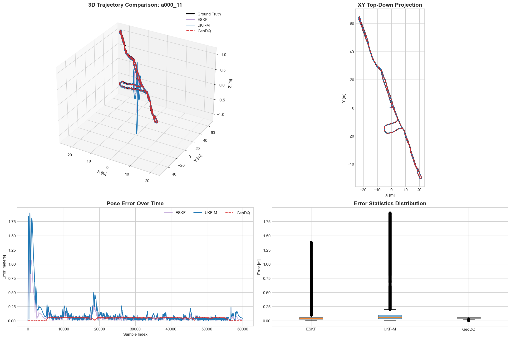

<div align="center">
<h1>Geometric State Fusion for Autonomous Agents: A Comparative Analysis of Dual Quaternion Observer and Kalman Filters</h1>

[**Ilya Afanasyev**](https://www.linkedin.com/in/ilya-afanasyev-8783291a/)<sup>1,2</sup>

<sup>1</sup>Innopolis University, Innopolis, Russia <br>
<sup>2</sup>Saint Petersburg Electrotechnical University "LETI", St. Petersburg, Russia 

<a href="INSERT_ARXIV_LINK_HERE"></a>
<a href='INSERT_GITHUB_LINK_HERE'></a>
<a href='INSERT_DATA_LINK_HERE'></a>

</div>

## Abstract

Autonomous agents operating in dynamic 3D environments—from wearable devices to embodied systems—require robust pose estimation that preserves the geometric structure of rigid-body motion. Traditional filtering approaches often decouple rotation and translation, leading to kinematic inconsistencies. This paper presents a comprehensive benchmark of three geometrically-aware sensor fusion architectures: a Dual Quaternion Geometric Observer (GeoDQ) using Screw Linear Interpolation (SCLERP), a manifold-aware Unscented Kalman Filter (UKF-M), and an Error-State Kalman Filter (ESKF). We reformulated the 6DoF sensor fusion problem on the SE(3) manifold to enable coordinate-free uncertainty propagation. We evaluated these approaches on the entire RoNIN dataset, utilizing optimized JIT-compiled implementations to assess real-time performance. Our extensive experimental results demonstrate that the GeoDQ method outperforms both ESKF and UKF-M in accuracy (RMSE: 0.046 m vs. 0.155 m and 0.264 m, respectively) while maintaining superior computational efficiency (~1.7 ms/step , comparable to ESKF and significantly faster than UKF-M). Furthermore, robustness tests under sparse position updates (up to 5 Hz) reveal that the geometric observer maintains stability where filtering methods degrade. This analysis confirms that dual quaternion-based observers offer a dominant solution for resource-constrained autonomous agents in GPS-denied environments.

**Keywords:** Geometric State Fusion, Dual Quaternion Interpolation, Error-State Kalman Filter (ESKF), Unscented Kalman Filter (UKF), SE(3) Pose Estimation, SCLERP, Robust Navigation, Computational Efficiency.

## Results

### Trajectory Tracking Performance



*Qualitative comparison on the RoNIN sequence `a000_11`. The 3D trajectory (top-left) and Top-Down projection (top-right) illustrate the tracking performance of ESKF (Purple), UKF-M (Blue), and the proposed GeoDQ (Red/Green dashed) against Ground Truth (Black). The error evolution plots (bottom) demonstrate that the Geometric Dual Quaternion observer maintains significantly lower translation error and variance compared to standard filter-based approaches.*

### Robustness Analysis


*Robustness analysis under sparse position updates (Sequence `a000_11`). The log-scale plot reveals the degradation of Root Mean Square Error (RMSE) as the time interval between external corrections increases (simulating GPS/VO loss). The proposed geometric observer (GeoDQ, Green/Dashed) exhibits superior structural stability, maintaining sub-meter accuracy even when updates are sparse, whereas Kalman Filter variants (ESKF, UKF) diverge exponentially.*

## Repository Structure

This repository contains the implementation of three sensor fusion architectures (ESKF, UKF, GeoDQ) along with their JIT-optimized variants.

### 1. Benchmarking & Analysis
*   **`RoNIN_Batch_Analysis_GeoDQ_JIT.ipynb`**: **(Main Entry Point)** The primary notebook that runs the full benchmark. It loads the filters, processes trajectories, calculates metrics (RMSE, ATE), performs the robustness test, and generates the plots/tables used in the paper.
*   **`RoNIN_Dataset_Batch_Processing.ipynb`**: Data preparation utility. Converts the raw RoNIN dataset (HDF5) into the standardized CSV format required by the benchmark pipeline.

### 2. Filter Implementations (Kernels)
The core logic is decoupled into standalone Python modules. Each method has a standard version (for reference/debugging) and a Numba-optimized version (for performance benchmarking).

| Method | Standard Implementation | JIT-Optimized Implementation | Description |
| :--- | :--- | :--- | :--- |
| **GeoDQ** | `GeoDQ_SCLERP.py` | `GeoDQ_SCLERP_JIT.py` | **(Proposed)** Dual Quaternion Geometric Observer using SCLERP. |
| **UKF-M** | `UKFM_INS.py` | `UKFM_INS_JIT.py` | Manifold Unscented Kalman Filter on $SO(3) \times \mathbb{R}^3$. |
| **ESKF** | `ESKF_INS.py` | `ESKF_INS_JIT.py` | Error-State Kalman Filter (Baseline). |

### 3. Misc
*   **`requirements.txt`**: List of Python dependencies required to run the code.
*   **`assets/`**: Contains plots and visualization results.

## Citation

If you find this project useful, please consider citing:

```bibtex
@inproceedings{afanasyev2026geometric,
  title={Geometric State Fusion for Autonomous Agents: A Comparative Analysis of Dual Quaternion Observer and Kalman Filters},
  author={Afanasyev, Ilya},
  booktitle={Proceedings of the 25th International Conference on Autonomous Agents and Multiagent Systems (AAMAS 2026)},
  year={2026}
}