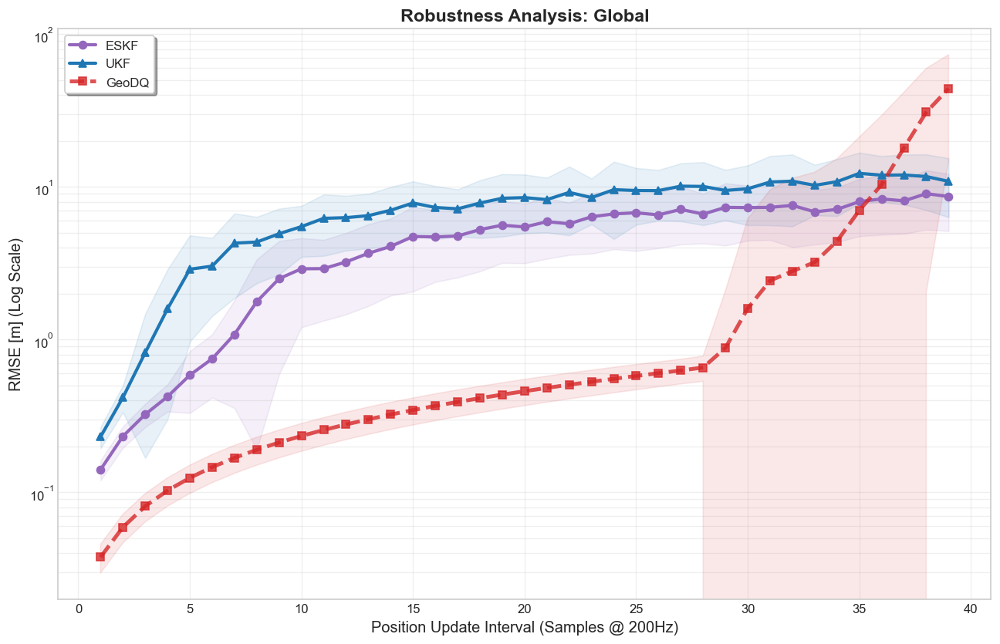
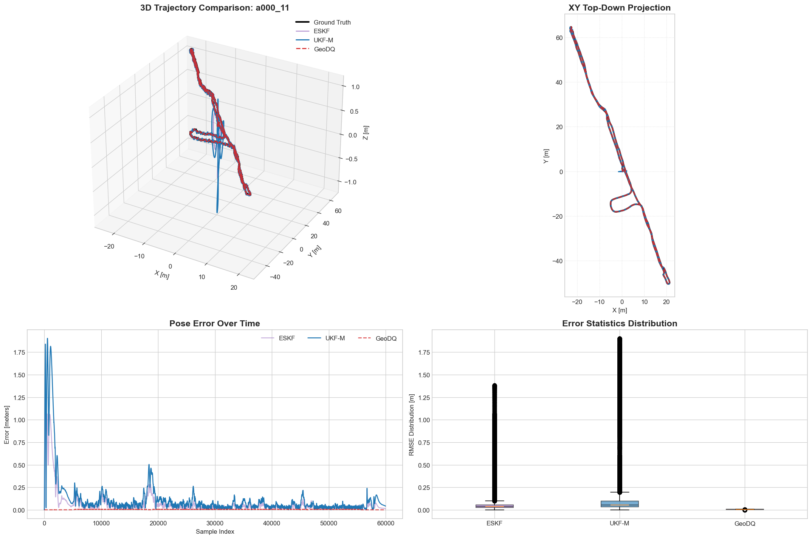
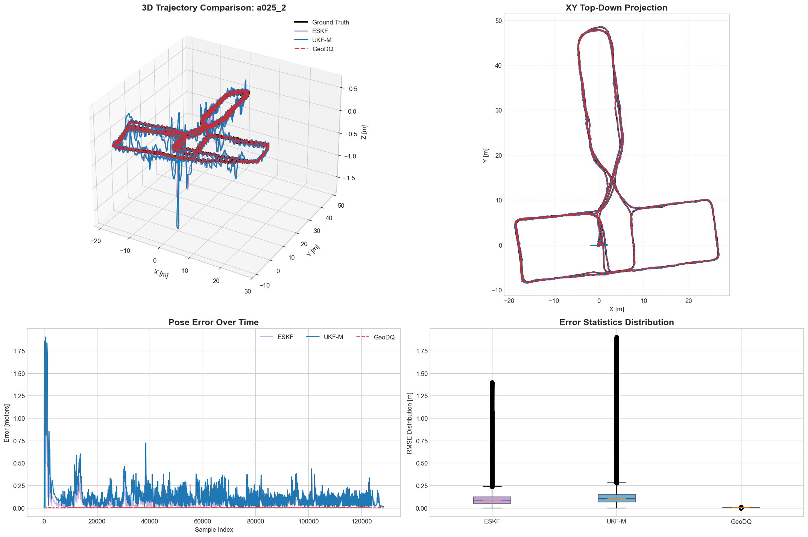
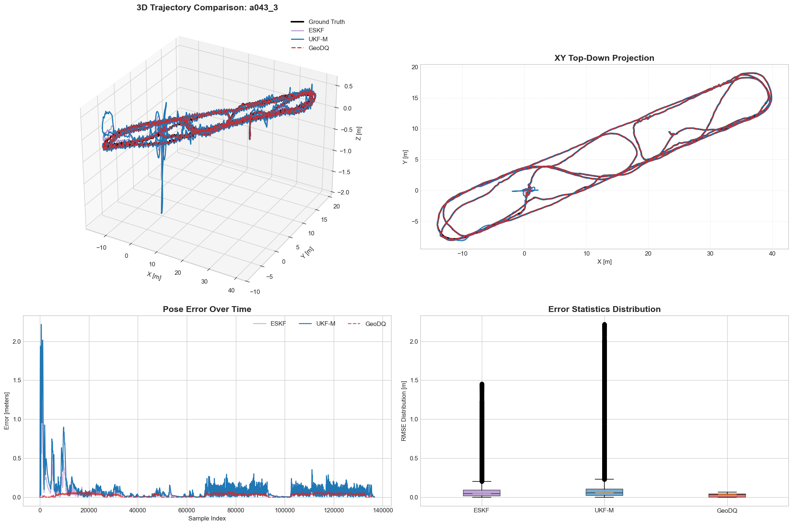

<div align="center">
<h1>Geometric State Fusion for Autonomous Agents: A Comparative Analysis of Dual Quaternion Observer and Kalman Filters</h1>

[**Ilya Afanasyev**](https://www.linkedin.com/in/ilya-afanasyev-8783291a/)<sup>1,2</sup>

<sup>1</sup>Innopolis University, Innopolis, Russia <br>
<sup>2</sup>Saint Petersburg Electrotechnical University "LETI", St. Petersburg, Russia   

<a href="#"></a>
<a href='https://github.com/afanasyspb/SE3-Manifold-Lib/blob/main/benchmarks/ronin_geodq_analysis.ipynb'></a>
<a href='https://ronin.cs.sfu.ca/'></a>

</div>

## Abstract

Autonomous agents operating in dynamic 3D environments require robust pose estimation that preserves the geometric structure of rigid-body motion. Traditional filtering approaches often decouple rotation and translation, leading to kinematic inconsistencies. This paper presents a comprehensive benchmark of three geometrically-aware sensor fusion architectures: a Dual Quaternion Geometric Observer (GeoDQ) using Screw Linear Interpolation (SCLERP), a manifold-aware Unscented Kalman Filter (UKF-M), and an Error-State Kalman Filter (ESKF). We reformulated the 6DoF sensor fusion problem on the SE(3) manifold to enable coordinate-free uncertainty propagation and evaluated these approaches on the entire RoNIN dataset (35 trajectories) using optimized JIT-compiled implementations. Extensive experimental results demonstrate that the proposed GeoDQ method significantly outperforms filtering baselines in accuracy, reducing the Root Mean Square Error (RMSE) by a factor of 3.7 compared to ESKF (0.038 m vs. 0.141 m) and 6.1 compared to UKF-M (0.038 m vs. 0.231 m). Furthermore, robustness analysis reveals that the geometric observer maintains superior tracking stability under sparse position updates (down to 7 Hz), significantly mitigating drift where filtering methods degrade. Despite the mathematical complexity of dual quaternion algebra, the optimized observer exhibits superior computational efficiency, executing ~10% faster than the standard ESKF and ~5 times faster than UKF-M. This performance confirms that dual quaternion-based observers provide a mathematically rigorous yet computationally lightweight solution suitable for high-frequency real-time estimation on resource-constrained embedded systems.

**Keywords:** Geometric State Fusion, Dual Quaternion Interpolation, Error-State Kalman Filter (ESKF), Unscented Kalman Filter (UKF), SE(3) Pose Estimation, SCLERP, Robust Navigation, Computational Efficiency.

## Results

### Benchmark Summary (RoNIN Dataset)

We evaluated the algorithms on 35 distinct trajectories. The table below summarizes the aggregated performance metrics, comparing standard Python implementations against Numba-optimized (JIT) versions.

| Method | RMSE [m] (Mean ± Std) | Execution [ms] |
| :--- | :--- | :--- |
| **ESKF (Standard)** | 0.1409 ± 0.0213 | 10242.8 |
| **ESKF (JIT)** | 0.1409 ± 0.0213 | 3189.2 |
| **UKF-M (Standard)** | 0.2329 ± 0.0382 | 41492.6 |
| **UKF-M (JIT)** | 0.2312 ± 0.0378 | 14624.7 |
| **GeoDQ (Standard)** | **0.0377 ± 0.0081** | 21054.7 |
| **GeoDQ (JIT)** | **0.0377 ± 0.0081** | **2813.6** |

> **Key Finding:** The proposed **GeoDQ (JIT)** architecture achieves the lowest tracking error while maintaining the fastest execution time. Notably, the **standard deviation** for GeoDQ is significantly lower ($\pm 0.0081$) compared to ESKF ($\pm 0.0213$) and UKF-M ($\pm 0.0382$). This indicates that the Geometric Observer provides the most consistent and predictable performance across diverse motion patterns, minimizing outliers where filter-based methods tend to diverge.

### Global Robustness Analysis



*Global Robustness Analysis averaged over all 35 RoNIN trajectories. The plot illustrates the degradation of RMSE (Log Scale) as the position update interval increases (simulating VO/GPS outages). The **GeoDQ observer** (Red/Dashed) maintains sub-meter accuracy and structural stability even when updates are decimated to 7 Hz (Interval ~30). In contrast, Kalman Filter variants (ESKF, UKF) exhibit exponential error growth much earlier, confirming the observer's superior handling of non-linear error dynamics.*

### Qualitative Tracking Performance


*Example of trajectory tracking on sequence `a000_11`. The 3D trajectory (top-left) and Top-Down projection (top-right) illustrate the tracking path of ESKF (Purple), UKF-M (Blue), and the proposed GeoDQ (Red/Green dashed) against Ground Truth (Black).*

<br>


*Example of trajectory tracking on sequence `a025_2`. Comparison of estimated paths against ground truth, highlighting drift reduction by the Geometric Observer.*

<br>


*Example of trajectory tracking on sequence `a043_3`. The GeoDQ observer maintains tighter convergence to the ground truth path compared to filter-based approaches.*

## Repository Structure

This project is hosted in the `SE3-Manifold-Lib` repository.

### 1. Benchmarking & Analysis
*   **[`benchmarks/ronin_geodq_analysis.ipynb`](https://github.com/afanasyspb/SE3-Manifold-Lib/blob/main/benchmarks/ronin_geodq_analysis.ipynb)**: **(Main Entry Point)** The primary notebook that runs the full benchmark. It loads the filters, processes trajectories, calculates metrics (RMSE, ATE), performs the robustness test, and generates the plots/tables used in the paper.
*   **[`tools/ronin_processor.ipynb`](https://github.com/afanasyspb/SE3-Manifold-Lib/blob/main/tools/ronin_processor.ipynb)**: Data preparation utility. Converts the raw RoNIN dataset (HDF5) into the standardized CSV format required by the benchmark pipeline.

### 2. Filter Implementations (Kernels)
The core logic is decoupled into standalone Python modules located in the `algorithms/` directory.

| Method | Standard Implementation | JIT-Optimized Implementation | Description |
| :--- | :--- | :--- | :--- |
| **GeoDQ** | [`algorithms/geodq/geodq_sclerp.py`](https://github.com/afanasyspb/SE3-Manifold-Lib/blob/main/algorithms/geodq/geodq_sclerp.py) | [`algorithms/geodq/geodq_sclerp_jit.py`](https://github.com/afanasyspb/SE3-Manifold-Lib/blob/main/algorithms/geodq/geodq_sclerp_jit.py) | **(Proposed)** Dual Quaternion Geometric Observer using SCLERP. |
| **UKF-M** | [`algorithms/filters/ukfm.py`](https://github.com/afanasyspb/SE3-Manifold-Lib/blob/main/algorithms/filters/ukfm.py) | [`algorithms/filters/ukfm_jit.py`](https://github.com/afanasyspb/SE3-Manifold-Lib/blob/main/algorithms/filters/ukfm_jit.py) | Manifold Unscented Kalman Filter on $SO(3) \times \mathbb{R}^3$. |
| **ESKF** | [`algorithms/filters/eskf.py`](https://github.com/afanasyspb/SE3-Manifold-Lib/blob/main/algorithms/filters/eskf.py) | [`algorithms/filters/eskf_jit.py`](https://github.com/afanasyspb/SE3-Manifold-Lib/blob/main/algorithms/filters/eskf_jit.py) | Error-State Kalman Filter (Baseline). |

### 3. Misc
*   **`requirements.txt`**: List of Python dependencies required to run the code.
*   **`docs/assets/`**: Contains plots and visualization results.

## Citation

If you find this project useful, please consider citing:

```bibtex
@inproceedings{afanasyev2026geometric,  
  title={Geometric State Fusion for Autonomous Agents: A Comparative Analysis of Dual Quaternion Observer and Kalman Filters},  
  author={Afanasyev, Ilya},  
  booktitle={Proceedings of the 25th International Conference on Autonomous Agents and Multiagent Systems (AAMAS 2026)},  
  year={2026}  
}